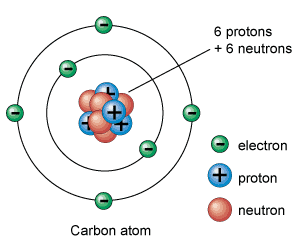
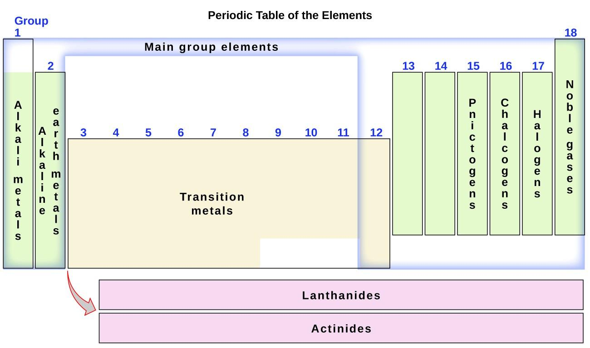
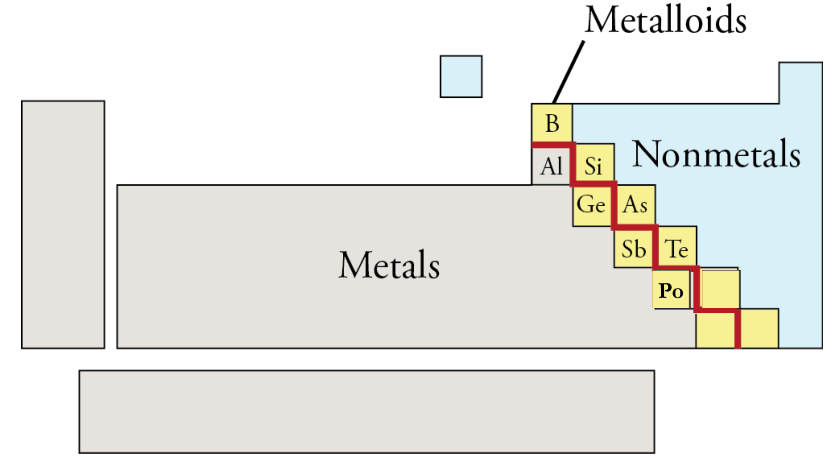
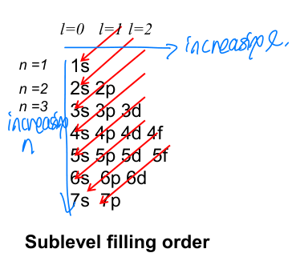

# Atoms and Elements

## Elements

* An element is a substance that cannot be broken down/chemically converted into simpler substances.
* 118 elements: 94 natural, 24 synthesized.
  
* A compound is bonding of multiple elements.

### Symbols of Elements

Symbols are an appreviation of the chemical name. They could be based on:

* English name
* Greek name
* Place of discovery
* Scientist name

#### Rules 
* One or two letters
* Capitalize first letter only

### Distribution of Elements

* Oxygen is the most abundant element in the Earth's crust.
* Naturally, the abundance of elements as well as the simplicity of their extraction plays a role in determining their rarity/cost.
* Other abdundant elements:
  * Silicon (Sand!)
  * Iron
  * Aluminium

## Particles

* A particle is the smallest unit of a chemical substance.
* A particle is made up of molecules, which in turn are made up of elements.
* A particle has 3 states: solid, liquid, and gas.

### Separation of substances

There are 2 techniques:

* **Physical**: does not change chemical composition, e.g. distillation, filtration.
* **Chemical**: results in new substances, e.g. hydrolysis.

## Atoms

* Building blocks of the physical world.
* Smallest unit of an element retaining an element's properties (protons, neutrons, electrons do not).
* The diameter of an atom is about 0.1nm = 10-10m = 1Å (angstrom).
* Atoms could be for a simple chemical substance, such as a _copper wire_ (which contains only Cu atoms). However, it could also be for complicated chemical substances like _plastic_.

### Monomers and Polymers

* Plastic is a **polymer**.
* **Monomers** are small molecules which may be joined together in a repeating fashion to form more complex molecules called **polymers**.
* Monomers are usually organic materials.

## Structure of the Atom

### Bohr's Model

* An atom is an electrically neutral, **spherical** entity composed of positively charged central nucleus surrounded by electrons.
* An atom is composed of protons (+vely charged), electrons (-vely charged), and neutrons.
* The # of protons = # of electrons in a natural, stable atom.

### Atomic Symbol

AZX 

* X = element symbol
* A = Mass number = # of protons + # of neutrons
* Z = Atomic number = # of protons (= # of electrons (in a neutral atom))

e.g.&nbsp;&nbsp;&nbsp;126C 

### Ions
* **Cation**: ion with positive charge.
If an atom loses one or more electrons it becomes a cation.
 e.g.: Na => Na+

* **Anion**: ion with negative charge. If an atom gains one or more electrons it becomes an anion. 
 e.g.: Cl => Cl-

### The Periodic Table

* Elements are sorted in increasing atomic number Z.

#### Families of Eements
* Some elements have similar properties, so they are grouped together by column in families/**groups**.
* This is based on their outer electron configuration (i.e. valence electrons).

#### Classification of Elements

Elements in the periodic table are classified into **metals**, **nonmetals**, and **metalloids**.

##### Characteristics of Metals
* Shiny.
* Conduct heat/electricity.
* Malleable.
* Tend to **lose** electrons.
##### Characteristics of Nonmetals
* Dull.
* Poor conductors.
* Nonmalleable.
* Tend to **gain** electrons.
##### Metalloids

Metalloids (also called transitive metals) have properties intermediate to metals and nonmetals.

#### Physical States of Elements

At room temperature (20 °C) and normal pressures, most elements are
solids, two are liquids (Hg and Br), and eleven are gases (H, N, O, F, Cl,
and the noble gases).

#### Molecular Elements

Some gases occur in nature as **diatomic molecules**. Each molecule of this element is formed of 2 atoms. H, N, O, F, Cl, Br, I.

### The Bohr Model: Revisited

* This model explains electron behavior.
* Electrons occupy orbits at fixed energies and fixed radii.
  * Each orbit accommodates a number of electrons.
  * The further away from the nucleus an orbit is, the higher amount of energy it has.
  * An electron occupying an orbit has a fixed energy level.
* Electrons are always spinning in motion. The energy of an electron is its **kinetic energy**.

#### Electron Configuration

* Electrons fill the lowest energy orbits available.
* Electrons _cannot_ exist in between orbits.
* Each orbit... 
  * is denoted an integer number n = 1, 2, 3... and is associated with a level of energy.
  * Can hold a maximum number of electrons e = 2n2. e = 2, 8, 18, ... for n = 1, 2, 3, ....
* Electrons can move from one orbit to another by exciting them, i.e. providing them with energy.
* Electrons do _not_ last in their excited state, thus any unspent energy they gain is released as light or heat.

##### Redox Reactions

* Electrons play a central role in **redox reactions**: a type of chemical reaction that involves a transfer of electrons between two species.
* An **oxidation** reaction leads to a gain of electrons.
* A **reduction** reaction leads to a loss of electrons.

#### Reactivity 

* Atoms with full OUTER orbits are extremely **stable**. Thus, they do not perform reactions.  These are known as the noble gases: He, Ne, Ar, ...
* Atoms with OUTER orbits which are not full undergo chemical reactions attempting to fill this orbit. 

#### Valence Electrons

* Electrons in the outer orbit are called the valence electrons.
* The kind of reactions elements undergo depend on their number of valence electrons.

### The Quantum Model

* In short, electrons can be seen as waves.
* Electrons move in a wavelike pattern. Their wave equations show a certain _probability distribution_ of where they can be found. The highest probabilities form weird shapes which indicate a region/cloud where electrons move.
* An **orbital** is a region around the nucleus where
there is a high probability of finding an electron.
* Electrons are grouped into energy level just like Bohr's model.
* An electron can be characterized by a number of quantum numbers to describe its motion: n, l, ml (as well as its spin).

#### Quantum Numbers

Every atomic orbital is specified by three quantum numbers.
  * Principle quantum number (**n**) = energy level = distance from nucleus = 1, 2, 3... positive integer.  It is also somehow a multiple of the wavelength of the electron's wave motion.
  * Azimuth quantum number (**l**) = shape of orbital = 0 ... n - 1.
  * Magnetic quantum number (**ml**) = orientation of orbital around nucleus = -l to l.   # of possible ml = 2n + 1.

#### Energy States and Orbitals

##### Energy Level

The energy level of an atom is given by its n value. The smaller the n value, the closer we are to the nucleus => the lower the energy level.

##### Sublevel

Each atom's level contains sublevels which designate the orbital shapes. Think of them as differently shaped orbitals on the same energy level; the differences in shape dictate varying energy levels (further from nucleus => higher).
  * l = 0 => s sublevel
  * l = 1 => p sublevel
  * l = 2 => d sublevel
  * l = 3 => f sublevel

An electron _cannot_ exist in a cross-orbital region known as a **node**.

##### Orbital

* A combination of n, l, and ml values describes an **orbital** (energy level, shape at that level, orientation). 
* Orbitals at the same n sharing the same shape have **same energy level** (i.e. the energy electrons most likely have is the same). They only differ in **orientation**.
  * s orbital is only one orbital, with a spherical beautiful shape. l=0 => ml = 0, hence this orbital has only one orientation.
  * p orbital is two lobes/regions of probability forming an orbital. p has l = 1, so # of ml = 3.
  * d has l = 2, so # of ml = 5. Thus d has 5 weird shape orbitals differing by orientation.
* Every orbital accommodates at most 2 electrons.  Thus, p orbitals in total can accommodate 2 * 3 = 6 electrons, and d orbitals in total can accommodate 2 * 5 = 10 electrons.

### Spin

* A spinning charged particle produces magnetism.
* Spin is thought to be the property of an electron which prevents it from collapsing to the nucleus.
* It is a property of an individual _electron_ and not the orbital itself.
* 2 electrons cannot have the same quantum numbers, so spin is opposing in the same orbital.
* Spin = ms = 1/2 or -1/2.

### Energy Levels

* Because a combination of n and l is used to determine energy level: **n + l rule**.
* Higher n + l => higher energy. If two orbitals share the same n + l (e.g.: 3d and 4s), pick the one with higher n.

### Sublevel Filling Order

* Each orbital holds at most 2 electrons.
* Lower energy orbitals are filled first.
* If there are empty orbitals on the same energy level, they are given higher priority than partially filled orbitals.
* Electrons in the same orbit have opposite spins.

## Molar Quantities

### Mass

* Mass of proton = 1 amu = 1.66 * 10-24g.
* The mass of a neutron is slightly bigger than the mass of a proton.
* The mass of an electron is negligible.

### Number of atoms

* 1 mole of any compound (mol) contains 6.022 * 1023 atoms (NA = Avogadro's number).

* n = m / M = N / NA.
  * m = mass of compound (g).
  * M = molar mass = A (g/mol).
  * N = number of atoms
  * NA = Avogadro's number = 6.022 * 1023.

* Example: 1 mole of Fe2(SO4)3 contains 2 moles of Fe, 3 moles of S, and 12 moles of O.

### Common Atoms

* Recall that the number of valence electrons of an atom can be determined from its group number.
* Recall that metals lose electrons and nonmetals gain electrons.
* The charge of an ion can be determined as: 8 - valence electrons, + for loss of electrons and - for gain.
* Some transition metals do not obey the octet rule, and as such, can carry a larger charge. Others have varying charges, such as Iron (II) = Fe2+, Iron (III) = Fe3+.
* -ide = monoatomic anion. -ate = polyatomic anion.
* Sulfate = SO42-. Nitrate = NO3-.
